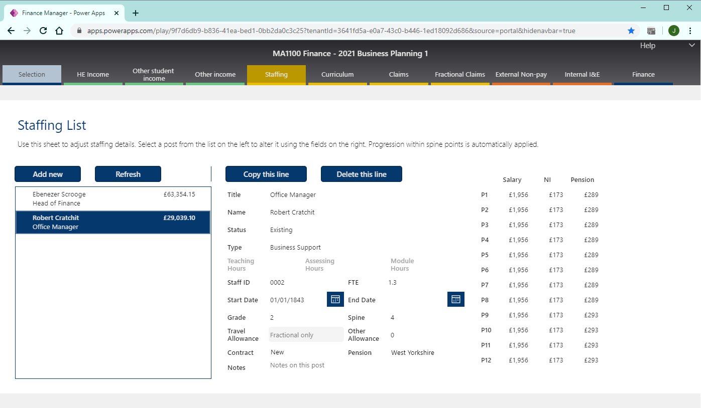

Using the Finance Manager PowerApp
==================================

The App was based on the 20/21 Business Planning 3 workbook, with each sheet in the workbook corresponding to a tab in the App. Use the 
navigation on the left to navigate to skip to a specific part of the app. 

.. warning::
    When editing data in the PowerApp, please be aware that data is edited in real time, and that the App may take a few seconds to write your changes. This can mean that if you change something 
    and do not wait for the PowerApp 'pips' at the top of the screen to end, then subsequent changes on the same screen may be lost.    

.. note::
    Several screens allow the user to detail income or expenditure by period (financial month). Though it is not mandatory to do so for the purposes of overall financial monitoring, 
    users are strongly encouraged to do so, to make future monitoring and forecasting more straightforward, and to help forecast cashflow. 

Selecting a set
---------------

The `Finance Manager PowerApp <https://apps.powerapps.com/play/9f7d6db9-b836-41ea-bed1-0bb2da0c3c25?tenantId=3641fd5a-e0a7-43c0-b446-1ed18092d686&source=portal&hidenavbar=true>`_ is built 
around the concept of a finance **set**, which is a unique combination of Cost Centre, academic year, and category (e.g. BP3). The **Selection** screen, which will load when the app opens, 
is used to select which set will be viewed/edited in the rest of the App. 

The first dropdown determines the cost centre used. The second determines the academic year and category. Once you've selected both, press **Load Selected** to bring the specified set to the App.

Once a set has been loaded, any key dates relevant to the set appear on the right. Dates are faded once they've passed. 

    Selection screen

Viewing Finances
----------------

The **Finances** tab summarises the finances for all existing sets in the selected cost centre. Clicking on a line shows an account-level
breakdown of what is behind the figures for that line in the current set (e.g., in the below screenshot, because 2021 BP1 is selected, the 
account level figures shown on the right are for 2021 BP1). 

.. warning::
    Currently, the finances shown here are not 'live': they are updated manually by an administrator, as PowerApps is unable to run 
    a full update due to authentication restrictions. 

    This will be fixed in the future. 

    Finances screen

Higher Education Income
-----------------------

The **HE Income** tab has three sub-sections:

Students
^^^^^^^^

View the number of HE students. If relevant to the set being viewed, the numbers can also be
edited: i.e. student numbers cannot be edited in forecasts as they are actuals, but can be edited in business planning. 

Regardless of the 'origin', income from Home students will be recorded against account 1240, and income from overseas students recorded against account 1245.   

.. note::
    This table supercedes the 'Student Number Interface' used in the 19/20 academic year

Fee Loss
^^^^^^^^

Specify the proportion of student fees which are expected to be lost to in-year withdrawal or suspension of study. The proportion is applied to the student appearing in the `Students`_ section. 

This defaults to 3.7% for both Home and Overseas students, which is based on the actual rate in previous academic years. 

The product of the given proportion and the student numbers does **not** need to be a whole number. This is to reflect that Fee Loss is defined as a probabilistic figure, rather than an actual quantity.   

The resultant amount of expected fee loss is attributed to accounts 1900 and 1901 for Home and Overseas fees respectively 
as negative income (i.e. a negative credit, and therefore a debit).   

.. warning::
    'Fee Loss' is **not** synonymous with 'Withdrawal Rate' used historically, which is typically significantly different.  

Bursary
^^^^^^^

Specify if there are any fee bursaries that will be awarded to students (not including the Access & Participation bursary). Most cost centres with HE students will not need to use this section. 

Bursaries entered wil reduce the fee income amount of the relevant fee status. 

    HE Income screen, with 3 subsections

Other Courses
-------------

This section is used to view and edit income from any non-HE courses. 

The course name field needn't be unique, i.e., a course can appear on multiple lines if that makes it easier for the user. 

The period columns should contain the total income for the given course in that period. This is to allow more flexibility than the previous system of specifying one fee, and a number of students per period. 

All income from this section is recorded under account 1250, income from other courses. 

    Other courses screen

Other Income
------------

This section is used to detail any income that is not from students enrolling on courses. 

The account field gives a general indication of the source of the income, but this should be supplemented with a description or rationale of the income. 

As far as possible, income should be entered in the period(s) that it is most likely to materialise.

    Other income screen

Staffing 
--------

This section is used to view and edit staffing. 

.. note::
    'Casual' posts should not included in this list. Use the `Claims`_ section instead.  

Staffing list
^^^^^^^^^^^^^

On the left of the screen is a list of all posts in the given selected set, showing post title, the name of the postholder, 
and the total cost of the post (including on-costs). 

The **Refresh list** button will refresh the list to reflect any changes made in the edit section. If the set has fractional staffing 
(and curriculum delivery), this button will also recalculate the fractional cost from any changes made to the curriculum model.

Post Edit
^^^^^^^^^

On the right of the screen is the form used to edit posts. There are three fields relevant only to :term:`Academic Management`; these fields 
are used to reduce the amount of curriculum delivery work that is allocated to fractional academics. 

* **Title**: title of the post.
* **Name**: name of the postholder, if known.
* **Status**: status of the post, in terms of whether it is new, existing, vacant, or terminated. If the status is anything other than 'Existing', then a information flag will be added to the side of the post in the `Staffing list`_. 
* **Type**: traditional categorisation of the post as 'Business Support, 'Fractional Academic', 'Management' etc. This field determines which accounts this post will be costed to.  
* **Teaching Hours**: *Academic Management posts only* hours spent teaching by Academic Management
* **Assessing Hours**: *Academic Management posts only* hours spent assessing by Academic Management
* **Curriculum Hours**: *Academic Management posts only* hours spent on mondule coordiantion by Academic Management 
* **Staff ID**: postholder's unique staff ID. Though not mandatory, it is important for accurately calculating on-costs for staff that work across multiple posts or departments. 
* **FTE**: indicative full time equivalent of the post. FOr all post types but Fractional, this is absolute; for Fractional posts, this is used to distribute work as specified in the curriculum model between all the fractional staff.  
* **Start Date**: date the post is occupied (if known).  
* **End Date**: date the post is vacated (if applicable).
* **Grade**: pay grade of the post. Used only for determining if a post is eligible for an automatic uplift in the next academic year (used only in Business Planning)
* **Spine**: spine point of the post. Not validated against the selected grade. Automatically uplifted in calculations for the next academic year, if eligible. 
* **Travel Allowance**: academic travel scheme amount that will be paid. 
* **Other Allowance**: other amounts paid for additional responsibilities. Can also be used to define 'spot salaries', i.e. those which are not on the regular pay framework. 
* **Contract**: Which version of the employment contract the member of staff is on. The majority of staff, and all new staff, will be on the 'new' contract.  
* **Pension**: The pension scheme the postholder is a part of.  
* **Notes**: Free-text box for adding notes to a post. 

    Staffing screen

Claims
------

This section is used to view and edit pay claims. 

The description field should include a brief explanation of the work that will be claimed for, and an appropriate account selected from the drop down. 

The rate should be the base hourly rate of the spine point of the staff expected to completed the work (or an average, if appropriate). This will be automatically increased/adjusted depending on the claim type selected:

* **Casual** will override the rate entered with the standard casual staff hourly rate plus statutory holiday accrual, and will add NI to the cost displayed. 
* **Teaching** will increase the rate entered by applying the teaching modifier and holiday accrual, and will add NI and pension to the cost displayed.
* **Other** will increase the rate entered by applying holiday accrual *on a sliding scale, dependent on the salary*. This is to acknowledge that staff below grade 7 will probably be business support and thus not eligible for holiday accrual, whilst those grade 7 or above will not be submitting claims unless they have a fractional contract or on the 'old' contract.    
* **Scenario Adjustment** will apply the verbatim rate, with no adjustment at all. Users should avoid using this type, as it only exists to integrate 'scenario planning' information inhereted from ancestor sets.  

    Claims screen

Curriculum
----------

This section is a read-only link to the `Curriculum Model <https://apps.powerapps.com/play/fb4b8384-7ac0-4e9f-af00-5367525c34f4?tenantId=3641fd5a-e0a7-43c0-b446-1ed18092d686&hidenavbar=true>`_. 

Using the curriculum delivery - as specified and updated by academic management - and the selected set's student numbers, the App calculates the number of teaching hours required. For shared modules, it calucaltes the 
proportion of the cost that the current cost centre is liable for, given the balance of student numbers. 

    Curriculum screen

Fractional Claims
-----------------

This is a small section applicable only to HE courses, which is used to move an amount of the cost of curriculum delivery *from* academic contracts and *onto* claims. 

This is useful to courses that do not put all of the teaching and assessing 'on contract', preferring to do some 'on claim'. The most common application is for assessment in performance courses.

For example, the below screenshot shows that instead of putting all teaching and assessment on contracts, 130 hours will be done on claim in each of January (P6) and May (P10). 

    Fractional claims split screen

Non pay
-------

This section is used to view and update non-pay expenditure, i.e. any expenditure that is not on the institution's staffing. 

The account field gives a general indication of type of the expenditure, but this should be supplemented with a description or rationale. 

As far as possible, expenditure should be entered in the period(s) that it is most likely to materialise.

    Non-pay expenditure screen

Internal Transactions
---------------------

This screen is used to view and update: 

*  income & expenditure within the institution, and
*  income & expenditure between the institution and the parent company. 

Although these transactions have no impact on the institution's net finances or the parent company's net finances respectively, they 
are often neccessary for departments to show an accurate picture of their financial performance, or to better monitor a type of spend (particularly access and participation). 

A detailed description should be given for all types of transaction. For internal transactions, a cost centre must also be specified: this 'contra' cost centre must contain the 
inverse of the amount detailed in order for the internal transaction to be included in the finances. 

    Internal transactions screen
